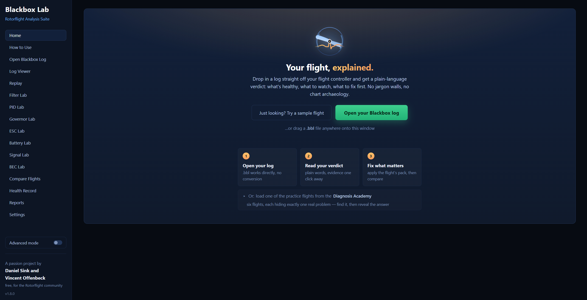
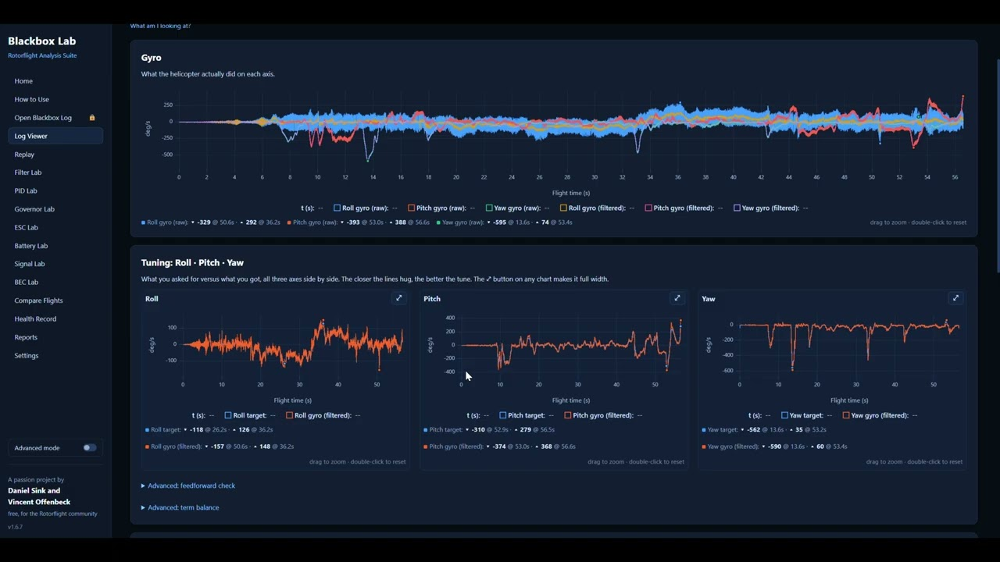
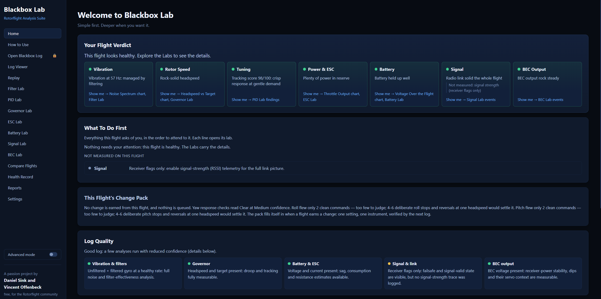
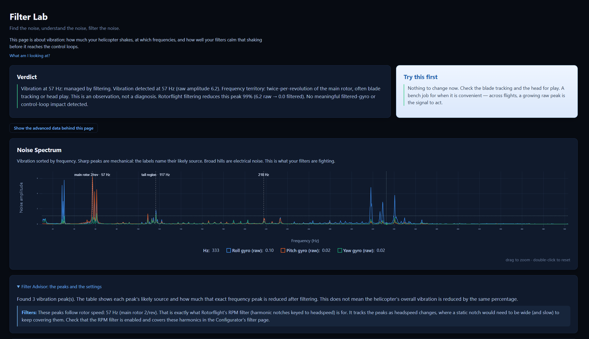
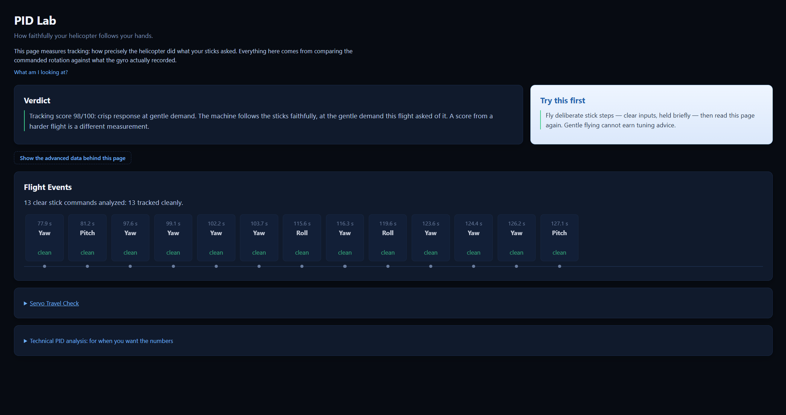
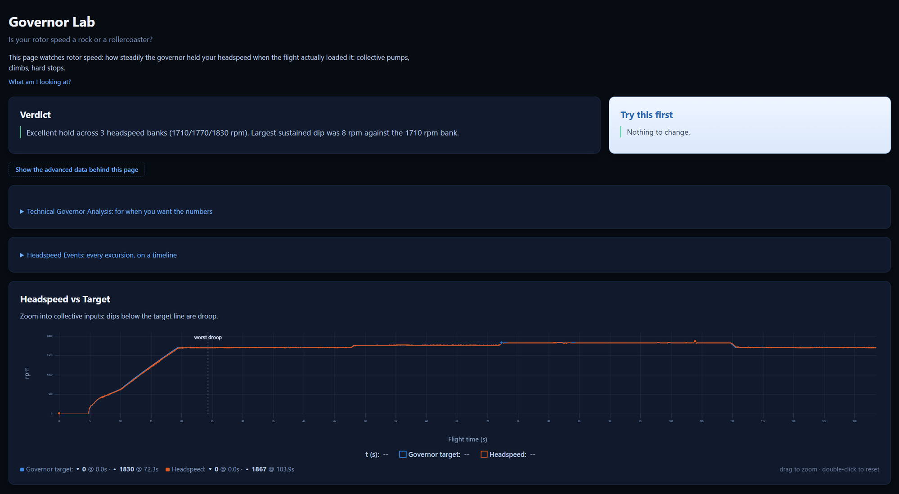
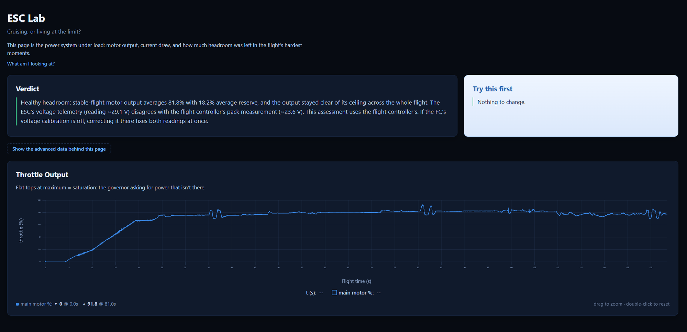
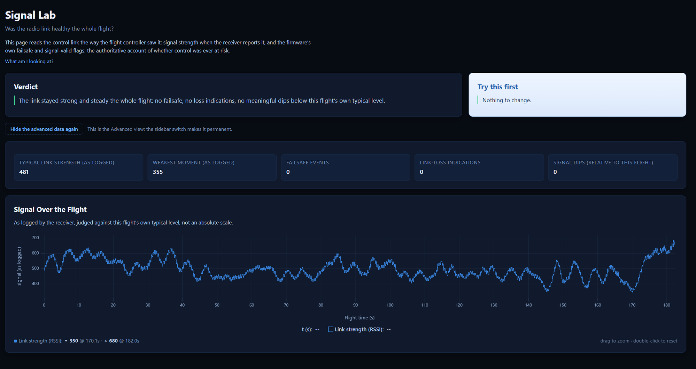
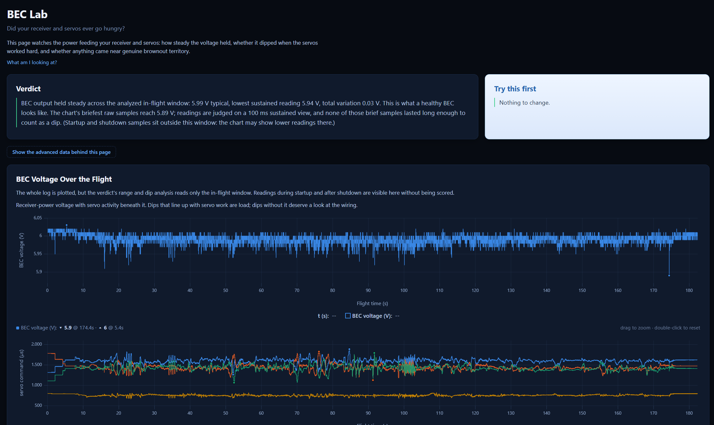
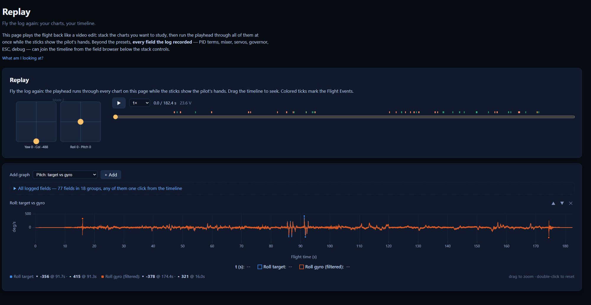

# Blackbox Lab

**Understand the flight. Follow the evidence. Make the next change for a reason.**

Blackbox Lab is a free Rotorflight Blackbox analysis suite built to help helicopter pilots turn flight logs into useful, understandable information.

It is designed for everyone from the pilot setting up their first Rotorflight helicopter to experienced tuners who want to dig deeply into the data.

Blackbox Lab does more than plot numbers.

It looks at the flight as a whole, evaluates the quality of the available evidence, explains what it found in plain language, and helps answer the question that matters most:

**What should I do next?**

Blackbox Lab never silently changes anything.

Every change happens through the pilot's explicit confirmation.

---

## What Blackbox Lab is — and is not

**Blackbox Lab is not an AI-driven flight-analysis system.** Its findings come from recorded Rotorflight log data processed through programmed formulas, thresholds, and rules.

**You do not need to understand blackbox logs, filters, or PID tuning to use it.** Blackbox Lab turns complex flight data into clear, plain-language findings, while still allowing experienced users to inspect the deeper evidence.

---

## Watch the tour

Seven minutes, the whole app in motion:

**[Blackbox Lab 180 Preview Tour](https://www.youtube.com/watch?v=ZFKA7wxAJ18)** — the Academy, Change Packs, Replay, the labs and the PDF report, walked through on a real log.

---

## Download & install

Blackbox Lab is free and runs on your computer. Your logs never need to leave it.

Grab the installer for your platform from the **[latest release](https://github.com/hillbilly1975/Blackbox_Lab/releases/latest)**:

- **Windows** — `Blackbox.Lab-<version>.Setup.exe`
- **macOS** — `arm64` zip for Apple Silicon, `x64` for Intel
- **Linux** — `.deb`, `.rpm`, or a plain zip

The installers are community-built and not commercially signed, so your operating system may ask once before the first launch — [Documentation/INSTALLING.md](Documentation/INSTALLING.md) walks through every platform's dialog in a few clicks.

Updating is the same download: install over the existing version. Your Health Record and settings are kept, and the app tells you on startup when a new version exists.

Developers can run from source — see the bottom of the [install guide](Documentation/INSTALLING.md).

<!-- screenshot: home / flight verdict -->

---

## The idea behind Blackbox Lab

A Blackbox log can contain an enormous amount of information.

Gyro data. PID terms. Setpoints. Governor behavior. ESC telemetry. Battery voltage. BEC voltage. Servo output. Rotor speed. Receiver data. Debug channels. Flight events.

The difficult part isn't collecting the data.

The difficult part is understanding what that data means.

Blackbox Lab was built to bridge that gap.

Instead of expecting every pilot to become an expert in signal analysis, filters, PID control and governor tuning before they can improve their helicopter, Blackbox Lab tries to turn the data into a guided diagnostic process.

The basic philosophy is simple:

*Fix what is physical before trying to hide it electronically.*

Then:

*Tune only when the evidence supports a change.*

A typical path might look like:

*Mechanical condition → Vibration → Filters → Governor → PID response → Confirmation flight*

The exact path depends on what the flight actually shows.

---

## What Blackbox Lab does

### Flight Verdict

The Home page gives you a high-level view of the flight before you dive into the details.

It summarizes areas such as:

- Vibration
- Rotor speed
- PID/tuning behavior
- ESC and power headroom
- Battery health
- Radio link
- BEC output

Each area explains what Blackbox Lab observed, why it matters and whether anything needs attention.

---

### What To Do First

Not every finding deserves equal priority.

Blackbox Lab orders recommendations so that a downstream tuning problem does not distract you from a more important upstream problem.

For example, if a helicopter has a significant mechanical vibration, Blackbox Lab may tell you to correct blade balance, tracking, damping or another mechanical source *before* changing filters or PID gains.

The goal is not simply to find problems.

The goal is to put them in the right order.

---

### Recommended Steps & Flight Change Packs

Blackbox Lab turns findings into a practical next-flight plan.

Instead of dumping a list of possible adjustments on the pilot, the system can identify:

- What deserves attention
- What does not need changing
- What needs more evidence
- What should be tested next
- What maneuver would provide better evidence
- What should be corrected before tuning continues

Where possible, Blackbox Lab encourages *a few meaningful changes at a time*, followed by another flight to verify the result.

That makes every flight part of the tuning process rather than another pile of unexplained data.

---

## Filter Lab

Filter Lab examines vibration before and after Rotorflight filtering.

It can help identify:

- Main rotor vibration
- Rotor harmonics
- Tail-region vibration
- High-frequency motor or bearing territory
- Raw gyro peaks
- Filtered residual vibration
- Filter effectiveness
- Rotor-speed-related vibration
- Noise that does not clearly match a known rotating source

Blackbox Lab separates *mechanical vibration* from *what remains after filtering*.

That distinction matters.

A filter can hide vibration from the gyro.

It cannot remove vibration from the helicopter.

---

## PID Lab

PID Lab examines how the helicopter responds to pilot commands.

It looks beyond a simple tracking score and analyzes individual command events.

Depending on the available evidence, it can evaluate:

- Tracking error
- Overshoot
- Settling
- Bounce-back
- Ringing
- PID contribution
- PID-term saturation
- Command balance
- Response behavior by axis
- Behavior at different headspeeds

Flight Events let you inspect the actual evidence behind the analysis.

A selected event can be tied directly to its command, response, chart window and supporting technical data.

Blackbox Lab also applies evidence gates before turning a pattern into a tuning recommendation.

Seeing something once does not automatically mean the pilot should change a gain.

---

## Servo Travel Check

A servo commanded past its travel limit mid-maneuver is a mechanical fact, not a tuning parameter.

Blackbox Lab watches for servo commands pinned at their limits during flight and reports the moments it happened.

No gain change fixes a control surface that has run out of arm.

---

## Governor Lab

Governor Lab examines how well rotor speed is being maintained throughout the flight.

Analysis can include:

- Average headspeed
- Governor target
- Sustained droop
- Tracking error
- Throttle/output behavior
- Available headroom
- Collective events
- Recovery behavior
- Precomp behavior

The goal is to distinguish a governor problem from a power-system limitation or a normal transient event.

---

## ESC Lab

ESC Lab looks at the power system from the controller's side.

Depending on the telemetry available in the log, it can evaluate:

- Motor output
- Throttle
- Output reserve
- Time near the output ceiling
- ESC voltage
- ESC current
- ESC temperature
- ESC RPM
- ESC telemetry availability

Blackbox Lab also tells you when the data required for a conclusion was *not recorded* rather than pretending to know something it cannot measure.

---

<!-- battery-lab screenshot pending: the pasted image duplicated the ESC Lab shot -->

## Battery Lab

Battery Lab evaluates the electrical behavior visible during the flight.

Depending on available telemetry, this can include:

- Pack voltage
- Voltage per cell
- Stable-flight voltage
- Voltage drop
- Sag
- Current
- Consumption
- Internal resistance evidence
- Load behavior

Missing current telemetry is reported as missing data rather than silently estimated as certainty.

---

## Signal Lab

Signal Lab examines the radio link during the flight.

Depending on what the receiver reported, analysis can include:

- Link quality over the flight
- Signal-strength levels and their worst sustained window
- The firmware's own failsafe and signal-loss flags
- Antenna-placement patterns (signal dropping with attitude)
- Cross-reference with BEC voltage at the same moments

A helicopter cannot be tuned around a link that keeps letting go of it.

If no signal telemetry was recorded, Signal Lab says exactly that — and still reports what the firmware's flags reveal.

---

## BEC Lab

BEC Lab examines receiver-power stability.

It distinguishes between brief raw samples and voltage changes that persist long enough to represent a meaningful dip.

Analysis can include:

- Typical BEC voltage
- Sustained voltage range
- Raw minimum samples
- Sustained dips
- Voltage stability
- Servo context

That distinction prevents a single short-lived sample from being presented as a sustained BEC failure.

---

## Compare Flights

Compare Flights lets you evaluate a change using a before-and-after flight.

Blackbox Lab checks whether the two flights are sufficiently comparable before making strong claims.

It can consider differences such as:

- Headspeed
- Flight demand
- Stick demand
- Maneuver coverage
- Available evidence

If the flights are not comparable enough, Blackbox Lab says so.

A numerical improvement is not automatically proof that a change worked.

Sometimes the correct conclusion is simply:

**Observed — not comparable enough to judge.**

---

## Health Record

Health Record turns individual flights into a longer-term picture of the helicopter.

It can track measurements from repeated flights while avoiding the temptation to call two points a meaningful trend.

The system can identify when:

- More flights are needed
- Flights are not sufficiently comparable
- A pattern is beginning to repeat
- A result appears stable over time

The goal is to build confidence gradually rather than manufacture certainty from too little data.

---

## Replay

Replay lets you fly through the log again.

All graphs share the same timeline and playhead, allowing you to watch commands, gyro response, PID terms, servo behavior, headspeed and telemetry together.

Preset graphs provide common views, while the field browser exposes *every field recorded in the log*.

Depending on the log, this can include:

- RC commands
- Setpoints
- P, I and D terms
- Feedforward
- Feedforward boost
- HSI/offset terms
- Raw gyro
- Filtered gyro
- Mixer inputs
- Servo outputs
- Motor outputs
- Governor terms
- Headspeed
- ESC telemetry
- BEC telemetry
- Power data
- Temperatures
- Attitude
- Accelerometer data
- Receiver information
- State flags
- Debug channels
- Core fields

Friendly names are shown alongside the original Rotorflight field names.

If the flight controller did not record a field, Blackbox Lab does not offer it.

---

## PDF Flight Reports

Blackbox Lab can turn the analysis into a portable flight report.

Reports preserve the same priorities and evidence used inside the application, including:

- Flight Verdict
- What To Do First
- Recommended next steps
- Flight Change Pack
- Evidence flights wanted
- Filter findings
- PID findings
- Governor analysis
- ESC analysis
- Battery analysis
- Signal analysis
- BEC analysis
- Flight events
- Supporting graphs

The report is intended to be understandable without requiring the reader to sit in front of Blackbox Lab.

---

## Evidence before recommendations

One of the most important ideas in Blackbox Lab is that *a measurement and a recommendation are not the same thing*.

A flight may contain something interesting without containing enough evidence to justify changing the helicopter.

Blackbox Lab therefore considers things such as:

- Number of valid events
- Flight demand
- Maneuver coverage
- Sample count
- Headspeed coverage
- Evidence imbalance
- Repeatability
- Vibration contamination
- Missing telemetry
- Comparability between flights

When the evidence is weak, Blackbox Lab should say so.

When the evidence is strong enough to justify the next step, it should say that too.

---

## Built for beginners without hiding the engineering

Blackbox Lab is intended to have two layers.

The first should answer:

**What does this mean, and what should I do?**

The second should answer:

**Show me the evidence.**

A new pilot should not need to understand FFT spectra, control-loop theory or PID mathematics to get useful guidance.

An experienced pilot should still be able to inspect the underlying numbers, events, fields and graphs.

Simple first.

Deeper when you want it.

---

## The Diagnosis Academy

Reading analysis results is a skill, and nobody should have to learn it on their own helicopter.

The Academy ships practice flights, each with one known planted problem — an underdamped axis, weak feedforward, a vibration source, governor droop, a dead sensor, a stale dump.

Open one, form your own verdict, then reveal the answer.

The truth about every practice flight is known exactly, because we built them that way.

It is a quiz you cannot crash.

---

## Contributed flights

The thresholds in Blackbox Lab are not guessed. They are measured against real contributed flights, and they get better as the fleet grows.

Sharing is a consent choice — the app asks once, plainly, and "no" means nothing is ever sent.

What a contribution contains is documented completely in [Documentation/CONTRIBUTED-DATA.md](Documentation/CONTRIBUTED-DATA.md). The short version:

- Flight telemetry and derived measurements, anonymized
- Never names, dates, serial numbers or absolute GPS positions
- An allowlist, not a blocklist: unknown fields are dropped
- Enforced by tests that fail the build if a rule breaks

To everyone who has shared flights: the recalibrated scoring in this release is what your logs built. Thank you.

---

## Where Blackbox Lab is going

The long-term goal is bigger than Blackbox analysis.

We want Blackbox Lab to become a *guided Rotorflight setup, diagnosis and tuning companion*.

One of the areas we are exploring is a beginner-focused workflow that could guide a pilot from their first safe shakedown flight through the tuning process.

That could eventually mean a workflow such as:

1. Complete the basic Rotorflight setup
2. Perform a safe initial flight
3. Check the mechanical condition
4. Identify significant vibration
5. Correct physical vibration where possible
6. Evaluate filtering
7. Evaluate governor performance
8. Evaluate PID response
9. Make one conservative change
10. Fly again and verify the result

The challenge is finding the correct balance between being useful quickly and refusing to make recommendations that the evidence cannot safely support.

That is an important part of where Blackbox Lab is headed.

Concretely, the next areas being explored:

- **Video overlay export** — the configurable Replay dashboard is the design surface: arrange the view, then render it as an overlay track for flight video, so the log and the footage tell one story.
- **Direct FBL access** — reading logs straight from the flight controller over USB, no card shuffle; and writing a flight's Change Pack to the FBL after explicit pilot confirmation, with every setting's actual value verified over the CLI before any change is applied.
- **Setup Wizard / Configuration** — guiding a pilot from a fresh flash to a safe first log and a one-click first analysis.
- **Web app** — Blackbox Lab in the browser: open a log without installing anything, same analysis, same honesty.

The longer list lives in [Documentation/BLACKBOX_LAB_ROADMAP.md](Documentation/BLACKBOX_LAB_ROADMAP.md).

The objective is not an automatic tuner.

The objective is something more useful:

**A system that helps the pilot understand what the helicopter is telling them and gives them a trustworthy next step.**

---

## A note about safety

Blackbox Lab analyzes recorded data.

It does not inspect the helicopter physically, and it cannot know every condition that exists outside the log.

Recommendations should always be considered alongside proper mechanical inspection, manufacturer guidance, Rotorflight documentation and safe operating practices.

Never continue a test flight if the helicopter is behaving unsafely.

Blackbox Lab never silently changes anything on your flight controller.

*Every change requires your explicit confirmation — every decision remains the pilot's.*

---

## A community project

Blackbox Lab exists because of testing.

Real helicopters.

Real logs.

Real edge cases.

Real bugs.

And a lot of flights that forced the software to become better at distinguishing what it knows from what it only suspects.

Feedback, unusual logs and reproducible issues are extremely valuable.

If Blackbox Lab gets something wrong, we want to know.

If it cannot understand a flight, we want to know that too.

That is how the project improves.

---

## Blackbox Lab 1.8.0 — The 180 Edition

Version 1.8.0 represents a major step in the evolution of Blackbox Lab.

The application has grown from a Rotorflight Blackbox analysis project into an increasingly connected flight-analysis and diagnostic system built around evidence, explainability and practical next steps.

And we're just getting started.

---

### Built with passion by Daniel Sink and Vincent Offenbeck

*Blackbox Lab*

Understand the flight. Follow the evidence.

---

## License

Blackbox Lab is free software, licensed under the [GNU General Public License v3.0](LICENSE) — in line with the wider Rotorflight and Betaflight ecosystem. Copyright (C) 2026 Daniel Sink and contributors.
