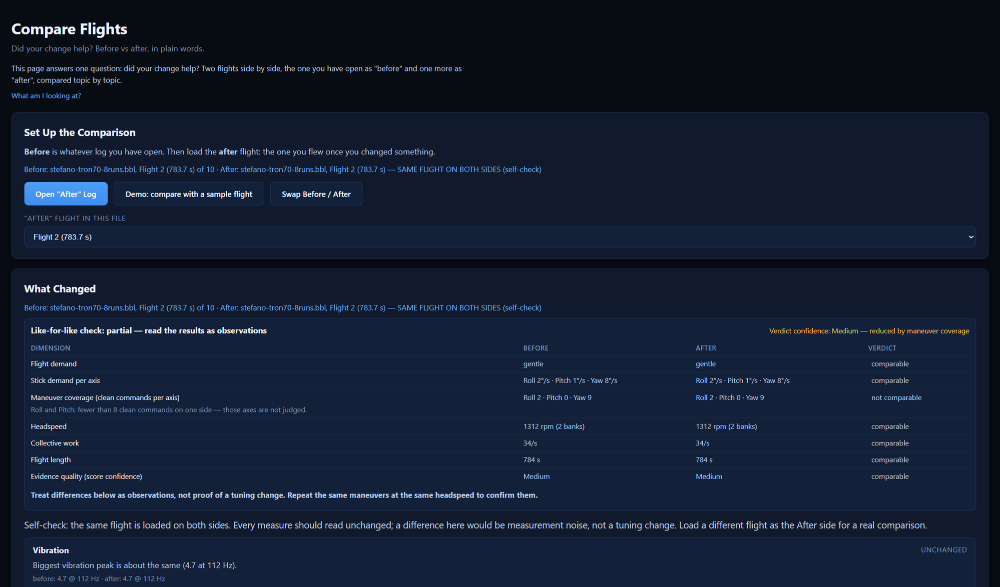

# Blackbox Lab

**Professional Rotorflight Analysis Suite**

> **Simple first. Deeper when you want it.**

Blackbox Lab is an open-source desktop application designed to make Rotorflight Blackbox log analysis simple for beginners while remaining powerful enough for advanced pilots.

## What Blackbox Lab is—and is not

**Blackbox Lab is not an AI-driven flight-analysis system.** Its findings come from recorded Rotorflight log data processed through programmed formulas, thresholds, and rules. AI assisted during development, testing, wording, and interface work, but it does not analyze flights or decide what changes a helicopter needs.

**You do not need to understand blackbox logs, filters, or PID tuning to use it.** Blackbox Lab is designed to turn complex flight data into clear, plain-language findings, while still allowing experienced users to inspect the deeper evidence.

---


## Download

Ready-made installers for **Windows, macOS and Linux** are on the
[Releases page](https://github.com/hillbilly1975/Blackbox_Lab/releases/latest)
— download, install, open a log. No build tools needed.

macOS comes in two builds: `darwin-arm64` for Apple Silicon (M1 and
newer) and `darwin-x64` for Intel Macs. **About This Mac** tells you
which you have.

Because the app is not signed with a paid Apple developer
certificate, macOS quarantines it after download. On **Apple
Silicon** this shows up as *"Blackbox Lab is damaged and can't be
opened"* — the download is fine; that message is just macOS being
protective about unsigned apps. Clear the quarantine flag once and
it opens normally from then on. In Terminal:

```
xattr -cr "/Applications/Blackbox Lab.app"
```

(Adjust the path if you keep the app somewhere else.) On **Intel**
Macs, right-click → Open on first launch is usually all it takes.

---

## What It Looks Like

**Open a log — get answers, not data.** Every flight lands on a
plain-language verdict with a "what to do" line and one-click
evidence:


**Evidence you can see.** The Filter Lab's noise spectrum labels
each peak with its likely mechanical source:


**Did your change help?** Compare two flights and get the answer
in one sentence per topic:



## Mission

Most Blackbox tools assume you already know how to read logs.

Blackbox Lab explains what happened during the flight using plain English and provides recommendations that help improve tuning, reliability, and confidence.

---

## Working Today

- **Native .bbl decoding** — open raw Blackbox files straight off
  the flight controller, no CSV conversion. Multi-flight files
  supported, corrupt bytes skipped gracefully.
- **What To Try Next** — evidence-gated recommendations on the PID
  and Governor pages: when enough events agree, the card names one
  setting, a direction and a small step, plus the exact number the
  next log must improve. Headspeed excursion events, precomp
  balance reads and cross-flight precomp trends feed it.
- **Flight Verdict** — answers first: plain-language cards with
  status, cause, what to do, and a jump straight to the evidence.
- **Log Quality Gate** — before analysis, the app tells you what
  this log can and cannot answer, and which logging settings to
  enable for more.
- **Charts, all laid out** — gyro, headspeed & governor, throttle,
  battery & current, and per-axis tuning presets for Roll, Pitch
  and Yaw: tracking, feedforward check and term balance. Drag to
  zoom; live min/max readouts follow the zoom window.
- **Noise spectrum** — built-in FFT shows vibration by frequency
  in the Filter Lab.
- **Filter Advisor** — peaks classified against rotor harmonics,
  filter attenuation measured unfiltered-vs-filtered, with
  concrete RPM-filter recommendations — mechanics first.
- **PID & Filter analysis** — scores, findings, confidence and
  recommendations in plain language. Missing telemetry gives an
  honest "could not be measured", never a fake score.
- **Governor, ESC & Battery Labs** — droop analysis, throttle
  headroom & saturation, voltage sag, estimated pack internal
  resistance and consumed capacity.
- **Compare Flights** — before vs after: "your change made the
  biggest vibration peak 86% better."
- **Health Record** — every analyzed flight is filed per craft
  (locally); rising vibration or droop across flights triggers a
  warning before something breaks. Individual flights can be
  removed from the record.
- **One-file reports** — verdict, findings and charts in a single
  shareable HTML file.
- **Beginner & Advanced modes** — calm by default, everything
  laid out when you switch.
- **Update check** — a quiet banner when a newer release exists.
- **Community log sharing** — strictly opt-in and anonymized:
  contributed logs help make the analysis smarter for everyone.
  Off until you say yes; details in
  [Documentation/CONTRIBUTED-DATA.md](Documentation/CONTRIBUTED-DATA.md).
- **Sample flights** — three ready-made logs in `samples/` (with
  documented ground truth) so you can explore without a log at
  hand ("Try a Sample Flight" — one click). These are recordings
  for the app — not firmware, nothing is ever written to a
  helicopter.

## On the Roadmap

- Video Overlay Export
- Direct FBL Access
- Setup Wizard / Configuration
- Web App

The longer list lives in
[Documentation/BLACKBOX_LAB_ROADMAP.md](Documentation/BLACKBOX_LAB_ROADMAP.md).

---

## Design Philosophy

Simple first.

Deeper when you want it.

---

## Running From Source (developers)

```
npm install
npm start        # run the app
npm test         # run the test suite
```

Then click "Open Blackbox Log" and pick a `.bbl`, `.csv` or CLI
dump — or try `samples/sample-bell-222ut.bbl` (a real
recorded flight) and visit
the Filter Lab.

## Status

🚧 Active Development

Built with Electron and JavaScript.

## License

Blackbox Lab is free software, licensed under the
[GNU General Public License v3.0](LICENSE) — in line with the wider
Rotorflight and Betaflight ecosystem. Copyright (C) 2026 Daniel Sink
and contributors.
